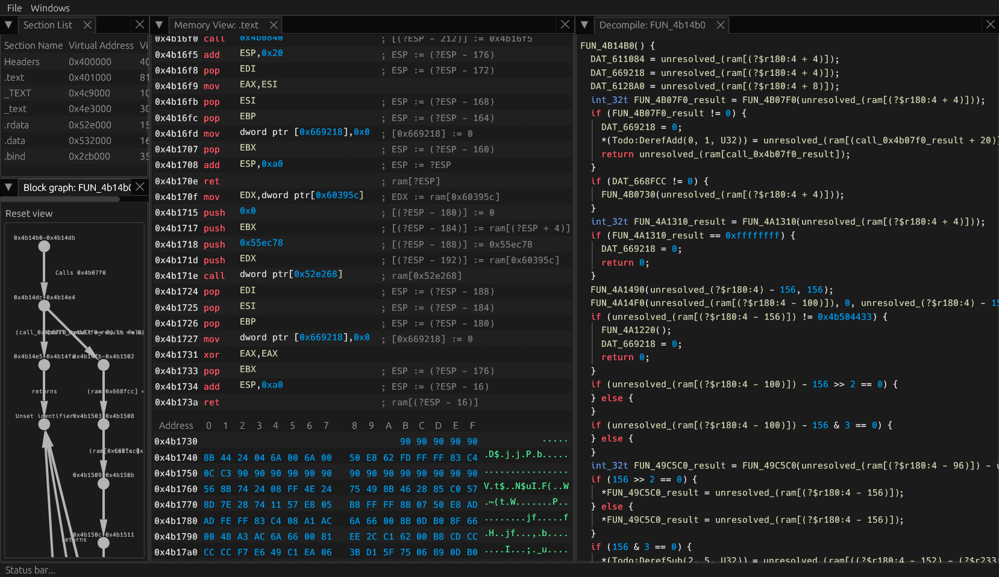

# Ouroboros — A Symbolic-Execution Decompiler

[](https://www.rust-lang.org/)
[](https://github.com/Hexorg/Ouroboros#license)
[](https://github.com/emilk/egui)

A fast, research-friendly decompiler built in Rust that recovers high-level structure from binaries using **symbolic execution**, **constraint tracking** instead of single static assignment IR models (though it can ingest SSA IR). It emphasizes block pre/post conditions, register/memory deltas, dominator/post-dominator analysis, and structured reconstruction (if/else, loops, SESE regions).



---

## Features

- **Symbolic Execution Core**
  Tracks path constraints and symbolic values to recover call arguments, globals, and side effects.

- **Constraint-Tracking SSA IR**
  VEX-inspired, def-use chains, register/memory deltas, and expression rewriting for clean lifting.

- **CFG + Structural Recovery**
  Dominators, post-dominators, and SESE discovery to form `if/else`, loops, and early-exit patterns.

- **Calling Convention Inference**
  Heuristics + dataflow to infer parameter/return passing across common ABIs.

- **Rust-first Performance & Safety**
  Zero-cost abstractions where possible; explicit, testable passes.

- **Beautiful UI**
  Thanks and a big shoutout to
  * [egui](https://github.com/emilk/egui) for this beautiful work.
  * [egui_dock](https://github.com/Adanos020/egui_dock) for managing dockable windows like a boss.
  * [egui_graphs](https://github.com/blitzar-tech/egui_graphs) for CFG drawing

---

## Quick Start

### Prerequisites
- **Rust** (stable). Install via <https://rustup.rs/>
- Recommended: `llvm-objdump`, `gdb`, or your favorite disassembler for comparison.

### Build
```bash
git clone https://github.com/Hexorg/Ouroboros.git
cd Ouroboros
cargo build --release
```

### Run

```bash
cargo run --release
```

Upon start, Use the menu bar and select File > Open... Then select a PE32 (or PE32+) binary. Currently, no automated analysis is available. Navigate to a know function start address, hover over the first byte of the instruction and press `D` to disassemble the instructions until `NOP` or an invalid instruction is encountered. Then Hover over the first address of the function and press `F` to decompile the function. This will symbolically execute the function and present decompiled result.

## License

Ouroboros is free, open source and permissively licensed! You can choose from

* MIT License ([LICENSE-MIT](LICENSE-MIT) or [http://opensource.org/licenses/MIT](http://opensource.org/licenses/MIT))
* Apache License, Version 2.0 ([LICENSE-APACHE](LICENSE-APACHE) or [http://www.apache.org/licenses/LICENSE-2.0](http://www.apache.org/licenses/LICENSE-2.0))

at your option.
This means you can select the license you prefer!
